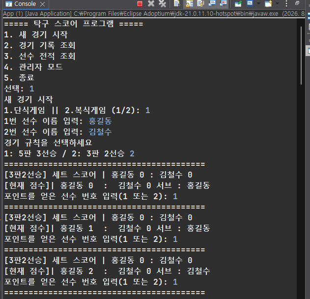
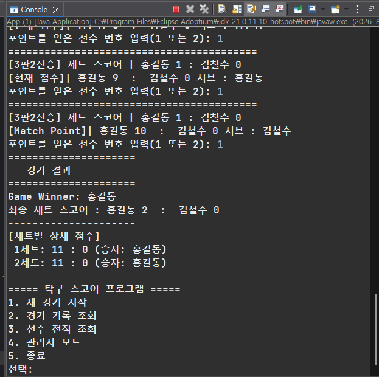
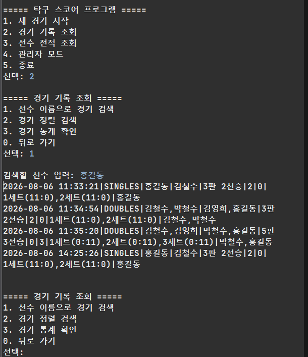
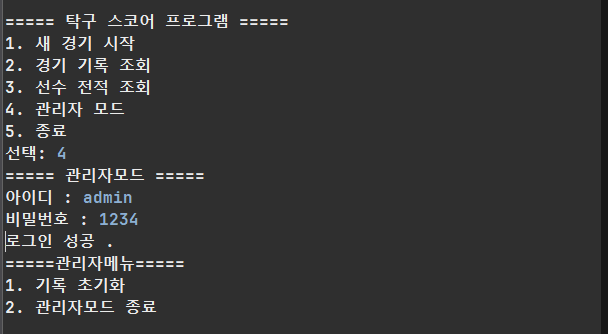
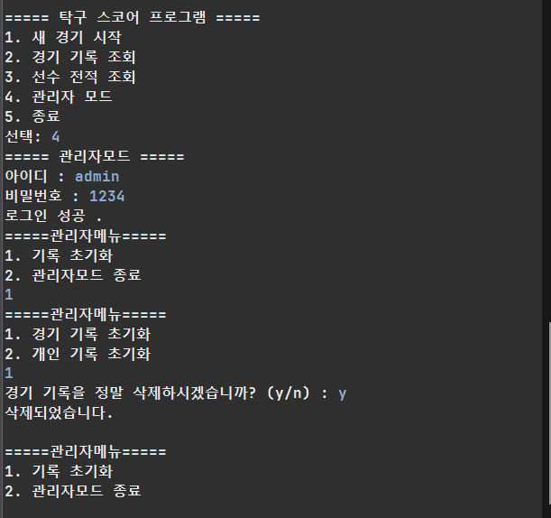

# 🏓 TableTennis_Score_Program

탁구 경기의 점수와 진행 상황을 관리하는 Java 기반 경기 운영 프로그램입니다.
단식/복식 경기를 지원하며, 서브권 교체, 듀스, 세트 승리 조건 등 실제 탁구 규칙을 반영하여 구현했습니다.

3인 1조 팀 프로젝트로 진행했으며, 본 README의 "구현 담당" 항목은 본인이 맡은 파트를 기준으로 작성했습니다.

## 📌 주요 기능

### 1. 듀스(Deuce) 처리
- 10:10 상황 발생 시 듀스 상태로 전환
- 듀스 상태에서는 2점 차이가 날 때까지 세트가 종료되지 않도록 구현
- 듀스 진입/해제에 따른 서브권 교체 규칙(2점마다 → 1점마다) 반영

### 2. 세트 승리 방식 선택 (3판 2선승제 / 5판 3선승제)
- 경기 시작 시 3판 2선승제와 5판 3선승제 중 선택 가능
- 선택된 방식에 따라 필요한 세트 승수를 자동 계산하여 경기 종료 시점 판단
- 세트별 승패 기록을 누적하여 최종 승자 판정

### 3. 서브권 관리
- 공식 탁구 규칙에 따라 2점마다 서브권이 자동으로 교체되도록 구현
- 듀스 상황에서는 1점마다 서브권 교체로 전환되도록 예외 처리
- 세트가 바뀔 때 서브 순서(선/후공) 규칙 반영

### 4. 단식 / 복식 경기 구분
- 경기 시작 시 단식/복식 여부 선택
- 단식과 복식에 따라 선수(또는 팀) 정보 입력 및 표시 방식을 다르게 처리
- 복식 경기의 경우 서브권 교체 시 선수 순서 규칙까지 고려하여 구현

### 5. 관리자 기능
- 관리자 권한으로 경기 생성, 점수 수정, 경기 강제 종료 등 운영 기능 제공
- 일반 사용자와 구분되는 관리자 전용 메뉴/권한 처리 구현

### 6. 경기 기록 저장 및 불러오기
- 진행된 경기의 세트별 점수, 승패 결과 등 경기 기록을 **txt 파일**로 저장
- 저장된 txt 파일을 다시 읽어와 과거 경기 기록을 조회할 수 있는 기능 구현
- (선수 개인 기록이 아닌 경기 단위 기록 관리)

## 🛠 기술 스택
- Java
- Eclipse (IDE)

## 📁 프로젝트 구조
```
TableTennis_Score_Program
├── src/com/test/java   # 소스 코드
├── data                # 경기 기록 저장 (txt 파일)
├── .classpath
├── .project
└── .gitignore
```

## 🎥 데모 영상

**1. 경기 진행 데모**


https://github.com/user-attachments/assets/ce7853da-3e78-47b0-b1ef-8d362d2d2839


**2. 예외처리 **


https://github.com/user-attachments/assets/17332784-7d8f-4953-af1e-dad80bf3bf9f


## 🖥 실행 화면

**1. 새 경기 시작 — 단식 경기, 서브권/듀스 진행**
콘솔 기반으로 단식/복식, 세트 방식(3판2선승/5판3선승)을 선택하고, 포인트 입력에 따라 서브권이 자동 교체되며 진행됩니다.



**2. 경기 결과 — 매치 포인트 및 최종 결과 출력**
Match Point 도달 시 표시되며, 경기 종료 후 세트별 상세 스코어가 자동으로 출력됩니다.


**3. 경기 기록 조회**
선수 이름으로 과거 경기 기록(단식/복식, 세트 스코어, 승자 등)을 txt 파일 기반으로 검색할 수 있습니다.


**4. 관리자 모드 로그인**
관리자 계정으로 로그인하여 관리자 전용 메뉴에 접근할 수 있습니다.


**5. 관리자 - 기록 초기화**
관리자 권한으로 경기 기록 또는 개인 기록을 선택적으로 초기화할 수 있습니다.


## 🚀 실행 방법
1. Eclipse에서 프로젝트 Import (Existing Projects into Workspace)
2. `src/com/test/java` 내 실행(main) 클래스 실행
3. 콘솔 안내에 따라 단식/복식, 세트 방식 등을 선택하여 경기 진행

## 👥 팀 구성
3인 1조 팀 프로젝트

## ✍️ 구현 담당 (본인 파트)
- 듀스 관련 로직 전체
- 3판 2선승제 / 5판 3선승제 구현
- 서브권 관련 로직 전체
- 관리자 기능
- 단식/복식 경기 구분 로직 전체
- 경기 기록(txt) 저장 및 불러오기
